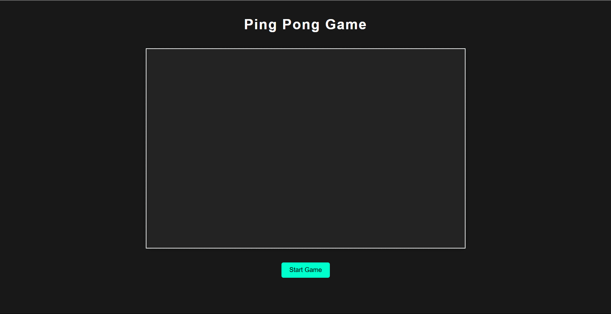
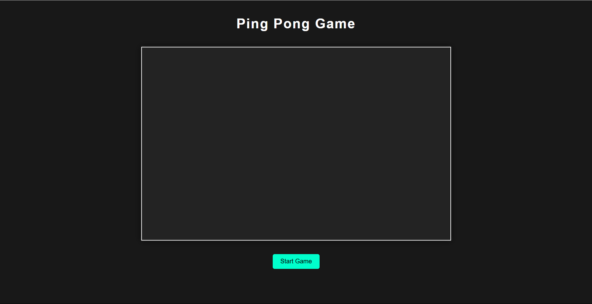
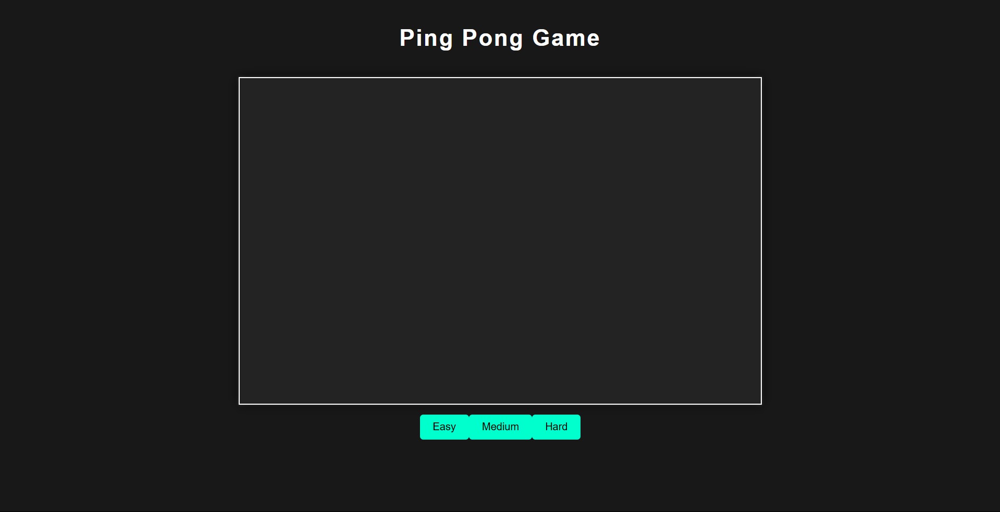
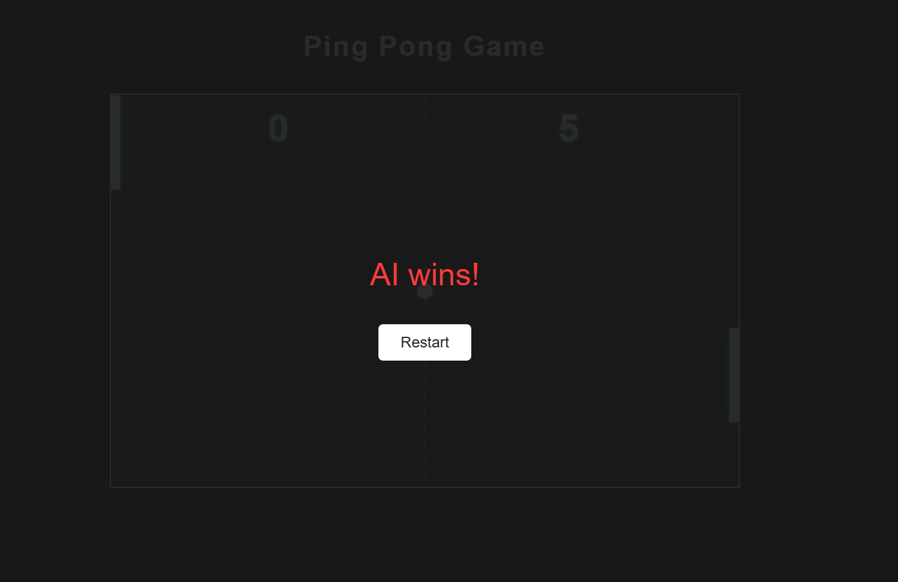

# 🏓 Ping Pong Game

A modern, responsive, and interactive single-player **Ping Pong Game** built using **HTML5 Canvas**, **Vanilla JavaScript**, and **CSS3**. Play against an AI opponent with adjustable difficulty levels and enjoy smooth gameplay with sound and animations.




## 📂 Project Structure

```plaintext
├── index.html       # Main HTML file with game layout
├── style.css        # Game UI styling
├── script.js        # Core JavaScript logic for gameplay
└── README.md        # Project overview and documentation
└── Images           # all project images
```

---

## 🎮 Features

* 🎯 Responsive UI with canvas-based game rendering
* 🤖 Smart AI opponent with 3 difficulty levels (Easy, Medium, Hard)
* 🕹️ Mouse and Touch controls supported
* 🎉 Victory and Game Over screen overlays
* 🌗 Stylish dark theme UI
* 🔁 Restart functionality with smooth transitions

---

## 🚀 Getting Started

### 1. Clone the repository

```bash
git clone https://github.com/your-username/your-repo-name.git
cd your-repo-name
```

### 2. Open in browser

Just open the `index.html` file in any modern browser:

```bash
start index.html  # On Windows
open index.html   # On macOS
```

---

## 🧠 How It Works

* The game runs in an HTML5 `<canvas>` using `requestAnimationFrame`.
* AI paddles move based on ball position with a `mistakeChance` factor.
* Difficulty level changes ball speed, paddle size, and AI speed.
* Collision detection determines ball trajectory upon hitting paddles.
* Victory condition is reaching a score of 5 points.

---

## ⚙️ Difficulty Levels

| Level  | Ball Speed | AI Speed | Paddle Height | AI Mistake Chance |
| ------ | ---------- | -------- | ------------- | ----------------- |
| Easy   | 5          | 2        | 120px         | 35%               |
| Medium | 6          | 4        | 100px         | 15%               |
| Hard   | 8          | 6        | 80px          | 3%                |

---

## 💡 Customization Tips

* Change canvas size in `index.html`:

  ```html
  <canvas id="pong" width="800" height="500"></canvas>
  ```

* Modify game speed or controls in `script.js`.

* Update game colors and fonts in `style.css`.

---

## 🚲 Built With

* HTML5
* CSS3
* Vanilla JavaScript
* Canvas API

---

## 🖼️ Screenshots

### Start Screen




### Choose Difficulty Level



### In-Game


### Game Over



---

## 📝 License

This project is licensed under the [MIT License](LICENSE).
You are free to use, modify, and distribute this game.

---

## 👨‍💻 Author
**Satwik Saxena**

---
## 👨‍💼 Contact Me via

LinkedIn: [Satwik Saxena](https://www.linkedin.com/in/satwik-12-dev/)

Email: satwiksaxena41@gmail.com

GitHub: [satwik12dev](https://github.com/satwik12dev)

---
## 🌟 Support

If you like the project, give it a ⭐ on GitHub!
